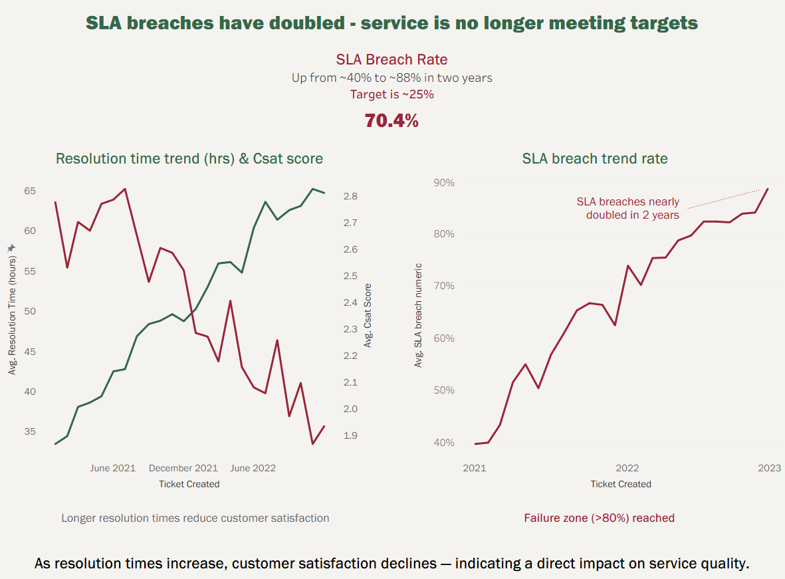

# Customer Support KPI Analysis




**Identifying SLA breaches, diagnosing bottlenecks, and modeling operational interventions**

## Project Overview

This project analyzes customer support performance using operational KPIs to identify service degradation, diagnose root causes, and model intervention scenarios.

The analysis follows a structured analytical narrative:

**Problem → Cause → Intervention → Impact**

The goal is not only to visualize metrics, but to simulate a realistic operational scenario and demonstrate analytical reasoning, data preparation, and decision-oriented storytelling.

---

# Semantic Layer (Business Context)

This dataset originally contained customer support tickets but did not exhibit a clear operational problem.
To simulate a realistic business scenario, I introduced controlled KPI drift using Python.

This created a **technical support bottleneck** with:

* Increasing resolution times
* Rising SLA breach rate
* Declining customer satisfaction
* Growing workload concentration

This allowed the project to model a realistic operational failure and evaluate intervention strategies.

The analysis answers three business questions:

1. Is service performance degrading?
2. What is causing the degradation?
3. Which intervention stabilizes performance?

---

# Dashboard Structure

## 1. Problem — SLA Breaches

The first dashboard identifies a major performance decline:

* SLA breach rate nearly doubled
* Resolution time increased
* Customer satisfaction declined
* Service no longer meets targets

This establishes that service performance is deteriorating.

---

## 2. Cause — Technical Support Bottleneck

The second dashboard isolates the root cause:

* Technical Support has highest resolution time
* Technical tickets concentrated in one team
* Technical Support trend increases fastest
* Channels linked to complex issues show highest SLA breach

This confirms a **structural bottleneck**, not a general performance issue.

---

## 3. Intervention — Operational Scenarios

The final dashboard models three scenarios:

**No Action**

* Resolution time continues increasing
* SLA breaches worsen

**Basic Intervention**

* Redistribution reduces workload
* Improvement limited

**Structural Intervention**

* Increased technical capacity
* Resolution time stabilizes
* SLA performance restored

This demonstrates that only structural intervention solves the underlying constraint.

---

# Data Pipeline

Raw dataset → Python → Cleaned dataset → Tableau dashboards

Steps:

1. Data inspection
2. Data cleaning
3. KPI simulation
4. Monthly aggregation
5. Tableau visualization
6. Scenario modeling

---

# Repository Structure

```
bktp_data/
    cleaned_tickets.csv
    customer_support_tickets.csv
    monthly_summary.csv

bktp_python/
    bktp_dataset_cleaning.py
    bktp_inspect_data.py

bktp_tableau/
    customer_support_performance.twbx

bktp_visuals/
    customer_support_performance.pdf
```

---

# Tools Used

Python (Pandas)
Tableau
CSV data modeling
KPI simulation
Business analytics storytelling

---

# Key Insights

* SLA breaches driven by technical support bottleneck
* Workload concentration creates structural constraint
* Redistribution alone insufficient
* Capacity increase stabilizes service performance

---

## Business Takeaway

SLA degradation was not caused by overall workload, but by a structural capacity constraint in Technical Support.  
Redistribution improved performance slightly, but only increasing technical capacity stabilized resolution time and restored SLA performance.

---

# Author

Oliver Pawlowski
Data Analysis & Data Visualization Portfolio Project

---

